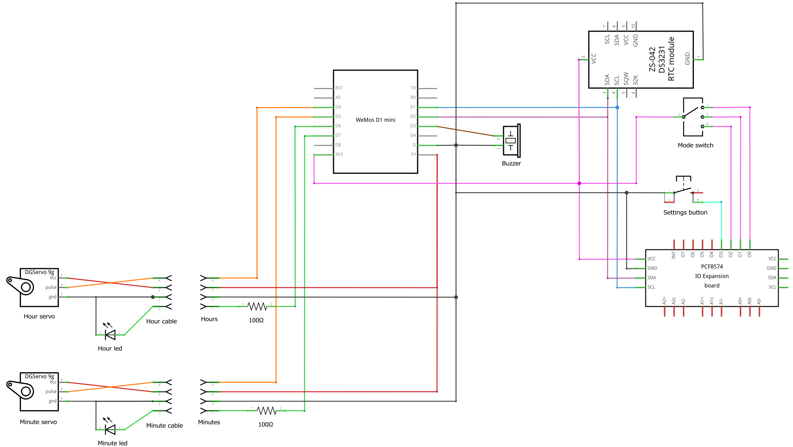

# Steampunk Clock 🕰️

 

## Hardware 🪛

### Components 🔩

- Wemos D1 Mini microcontroller (ESP8266)
- PCF8574 I2C expander module 
- DS3231 RTC module + LIR2032 rechargable 3.6V battery
- 2× SG90 servo motors
- 2× yellow led filament strips 38mm length
- 2× 100 Ω resistors
- 4-position (rotary) switch
- Push button
- Active buzzer (12×9.5mm)
- Cables, connectors

### Wiring 🛠️

See the details in the [wiring/steampunk-clock.fzz](./wiring/steampunk-clock.fzz) file. 

## Software 💻

### Getting Started 🚀

Install the [Arduino Maker Workshop](https://marketplace.visualstudio.com/items?itemName=TheLastOutpostWorkshop.arduino-maker-workshop) Visual Studio Code extension.

Install the following libraries:
- [Adafruit BusIO by Adafruit](https://github.com/adafruit/Adafruit_BusIO)
- [Adafruit PCF8574 by Adafruit](https://github.com/adafruit/Adafruit_PCF8574)
- [RTCLib by Adafruit](https://github.com/adafruit/RTClib)
- [WiFiManager by tzapu](https://github.com/tzapu/WiFiManager)
- [OneButton by Matthias Hertel](https://github.com/mathertel/OneButton)

The exact versions of these libraries used to create this code are visible in the [sketch.yaml](./sketch.yaml) file.

### Configuration ⚙️

Check the settings in the [config.h](./config.h) file.

**IMPORTANT FOR SECURITY!** Make sure to set a custom password in the `WIFI_AP_PASSWORD` field!

### Connecting to WiFi 📶

When the RTC module reports power loss the clock connects to a Network Time Protocol (NTP) server over the internet to get the current time.

The first time the module will create a temporary WiFi access point with the SSID and password defined in the `WIFI_AP_SSID` and `WIFI_AP_PASSWORD` values in the [config.h](./config.h) file.

Steps to connect to your local wireless network:

- Connect to this temporary access point.
- Navigate to http://192.168.4.1 in your browser.
- Select your network and enter your WiFi password.

## Acknowledgements 🙏

Thanks to Werner Rothschopf for his NTP articles:

- [NTP DST for the ESP8266](https://werner.rothschopf.net/202011_arduino_esp8266_ntp_en.htm)
- [NTP / Timezone Configuration via Webserver Interface (ESP8266, ESP32)](https://werner.rothschopf.net/202011_arduino_esp8266_ntp_en.htm)

## About the author

This project is created and maintained by [György Balássy](https://www.linkedin.com/in/balassy).
